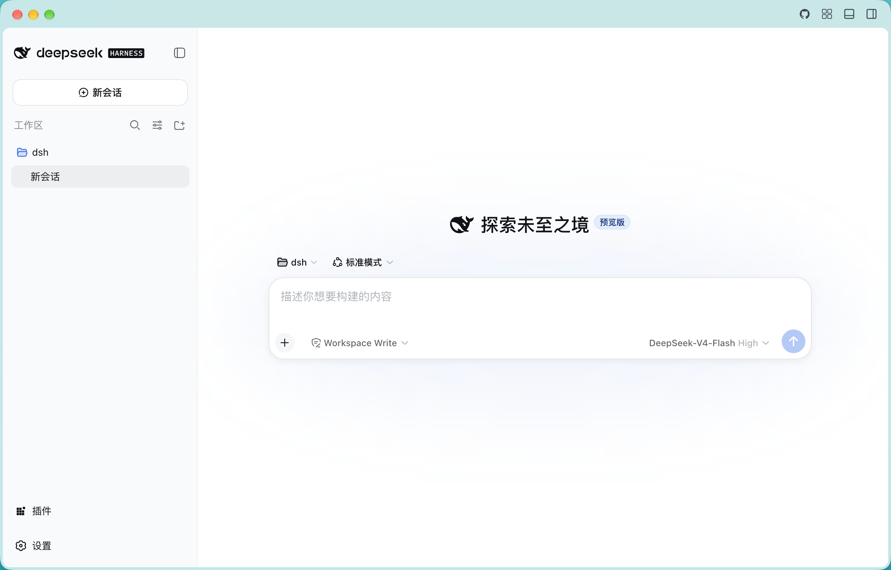
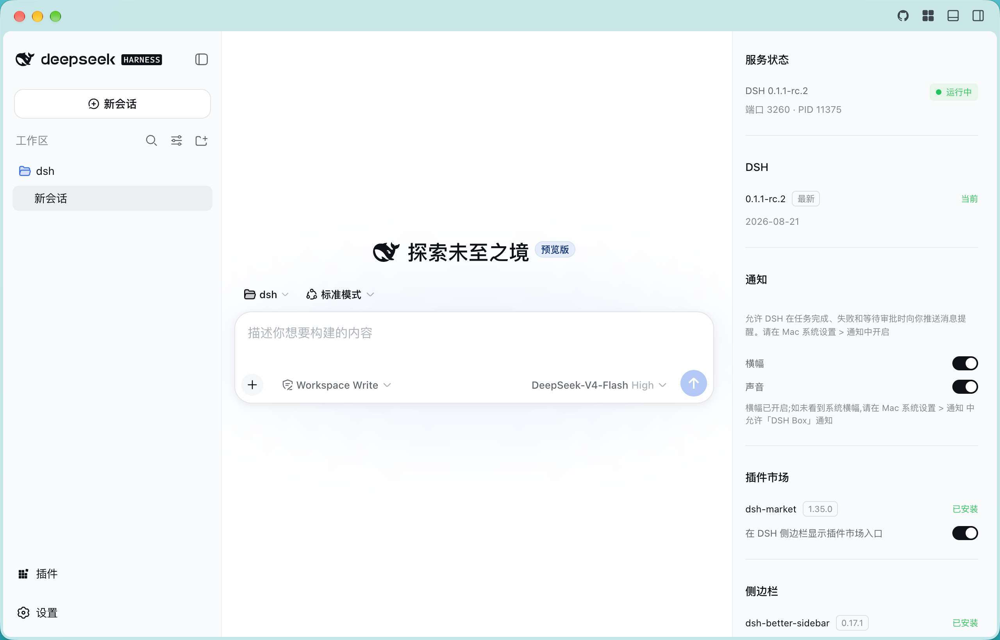
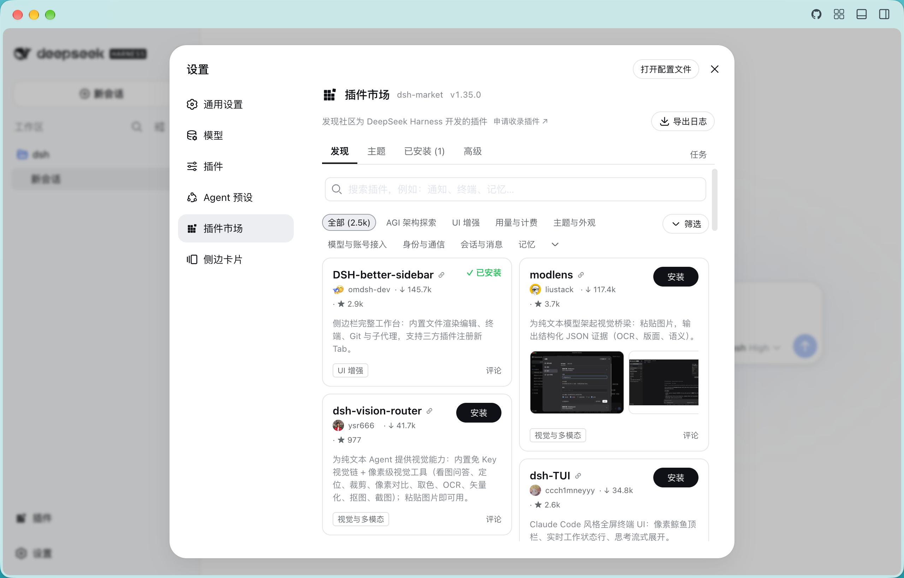
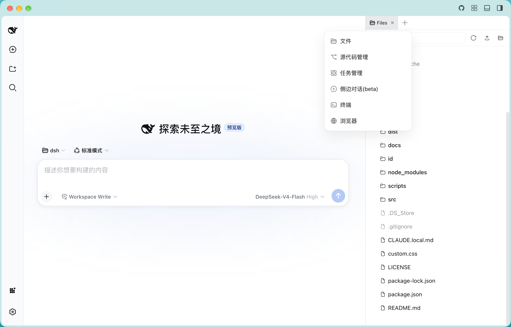
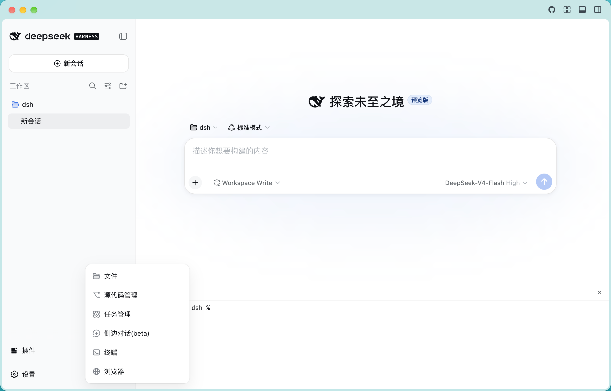

# DSH Box

[English](README.en.md) | 简体中文

把 [DeepSeek Harness](https://github.com/deepseek-ai/deepseek-harness/) 封装成原生 macOS 桌面应用。

## 简介

- **完全使用 DeepSeek Harness 开发**：本项目的全部代码均在 DeepSeek Harness 中驱动完成。
- **基于 Electron 的 dsh 壳**：将 DeepSeek Harness 的 WebUI 封装为原生 macOS App，让 Harness 以原生应用的身份运行，获得浏览器做不到的本地文件系统访问能力（子进程直接继承 macOS TCC 权限）。
- **版本检测与一键升级**：主动检测 DeepSeek Harness 的版本更新，支持在应用内一键升级（下载 → sha512 校验 → 原子替换 → 失败自动回滚）。
- **内置 [dsh-market](https://github.com/dsh-market/dsh-market) 插件**：浏览、搜索、安装、更新、卸载社区插件。
- **内置 [DSH-better-sidebar](https://github.com/omdsh-dev/DSH-better-sidebar) 插件**：为 Harness 增强侧边栏（右侧栏 / 底部面板 / 边卡）。
- **dsh 打进 App，开箱即用**：用户无需安装 Node.js，也无需安装 dsh。

## 截图

| 主界面 | 服务状态面板 |
|:---:|:---:|
|  |  |
| **插件市场** | **侧边卡片与底部面板** |
|  |  |
| **底部面板** | |
|  | |

## 工作原理

Electron 主进程把 `dsh web` 作为**子进程**拉起，窗口内以 `WebContentsView` 加载 Harness WebUI 并叠加自定义顶栏。dsh 通过 `ELECTRON_RUN_AS_NODE` 使用 App 自带的 Electron 运行时执行，因此用户机器上不需要 Node.js。由于 dsh 是本机用户进程，它执行的 shell 命令与文件操作直接继承 macOS 权限（TCC）——这是浏览器方案无法做到的，也是本项目的核心价值。

macOS 权限授予方法见 [docs/PERMISSIONS.md](docs/PERMISSIONS.md)。

## 架构

```
┌────────────────────────────────────────────────┐
│  DSH Box.app (Electron)                        │
│                                                │
│  主进程 src/main/main.js                       │
│    ├─ spawn ──→ dsh web 子进程 (Node)          │
│    │               └─ spawn ─→ bash / shell    │
│    ├─ WebContentsView 顶栏 (topbar)            │
│    ├─ WebContentsView 内容 (加载页 → WebUI)    │
│    └─ WebContentsView 状态面板 (兜底)          │
│            ▲ contextBridge                     │
│            │                                   │
│        preload.js (最小 IPC 桥，不暴露 Node)   │
└────────────────────────────────────────────────┘
```

- `src/main/` — 主进程：dsh 服务托管、窗口管理、插件管理、版本检测与升级、系统托盘。
- `src/preload/` — contextBridge 最小 IPC 桥。
- `src/renderer/` — 加载页、自定义顶栏、状态面板兜底页、关于页。
- `custom.css` — 注入 WebUI 的用户自定义样式模板（取消注释即生效）。

## 功能特性

- **dsh 服务托管**：启动、健康检查、崩溃原因反馈、优雅停止；独立 `DSH_HOME` 与浏览器 WebUI 数据隔离；全局单实例锁。
- **原生外观**：隐藏系统标题栏，自定义可拖动顶栏；内容区内缩圆角 + 毛玻璃材质；主题跟随 Harness 浅色/深色设置。
- **服务状态面板**：服务信息、DSH 与插件版本检查（红点提醒）、通知设置、应用内一键升级 dsh。
- **插件管理**：dsh-market / DSH-better-sidebar 一键安装、更新，版本落后自动提示。
- **系统集成**：菜单栏 Tray、系统通知、关于页。

## 快速开始

环境要求：macOS 14+（Apple Silicon）、Node.js ≥ 20。

```bash
# 安装依赖(会把 dsh 一起装进来)
npm install

# 环境体检(可选)
npm run doctor

# 启动
npm start
```

打包发布：

```bash
npm run dist        # 打包 .app + .dmg，输出到 dist/
```

## 配置

| 环境变量 | 默认值 | 说明 |
| --- | --- | --- |
| `DSH_APP_PORT` | `3260` | WebUI 监听端口 |
| `DSH_BIN` | 自动查找 | 显式指定 dsh 可执行文件路径 |
| `DSH_HOME` | App 数据目录 | Harness 数据目录，默认与浏览器 WebUI 隔离 |
| `DSH_NPM_REGISTRY` | `https://registry.npmjs.org` | 版本检查/升级用的 npm 镜像（如 npmmirror） |

## 许可

[MIT](LICENSE)。DeepSeek Harness 本身同为 MIT（见其[仓库](https://github.com/deepseek-ai/deepseek-harness/)）。
